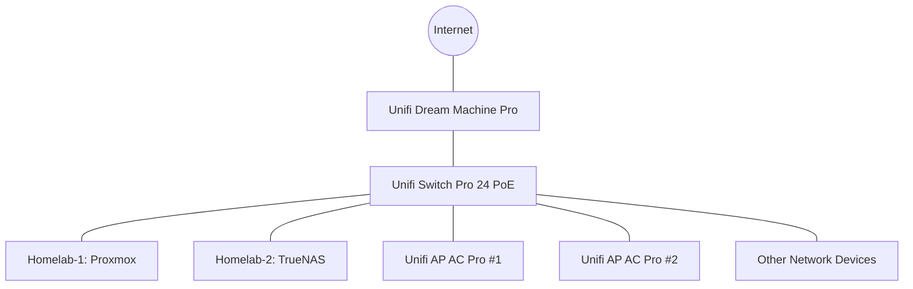

# Hardware Overview
{: .no_toc }

This section provides information about the physical hardware components of the homelab.

## Table of contents
{: .no_toc .text-delta }

1. TOC
{:toc}

---

## Hardware Stack

The homelab is built using a combination of custom-built servers, network equipment, and storage solutions. The current hardware stack includes:

- **Servers**: 2 compute nodes for virtualization and containerization
- **Network**: Managed switches, router, and wireless access points
- **Storage**: NAS with redundant storage arrays
- **Power Management**: UPS for power protection and management

## Server Specifications

| Server    | Role           | CPU              | RAM   | Storage                 | OS            |
|:----------|:---------------|:-----------------|:------|:------------------------|:--------------|
| Homelab-1 | Hypervisor     | AMD Ryzen 9 5950X| 64GB  | 2TB NVMe + 8TB RAID10  | Proxmox VE 7  |
| Homelab-2 | Backup/Storage | Intel i7-11700K  | 32GB  | 1TB NVMe + 16TB RAID6  | TrueNAS Scale |

## Network Equipment

| Device              | Quantity | Purpose                                    |
|:--------------------|:---------|:-------------------------------------------|
| Unifi Dream Machine Pro | 1    | Router, Firewall, Network Controller      |
| Unifi Switch Pro 24 PoE | 1    | Core Switch with Power over Ethernet      |
| Unifi AP AC Pro     | 2        | Wireless Access Points                    |

## Upgrade Plans

{: .note }
This section contains future hardware upgrades being considered for the homelab.

- Add a third compute node for increased redundancy
- Upgrade networking to 10GbE for improved storage performance
- Implement hardware-level remote management (IPMI/iDRAC/iLO)

## Hardware Topology

The diagram below shows the physical connections between the main hardware components:

## Power Consumption

Current estimated power consumption for the entire homelab:

| Component      | Power Draw (Watts) | Daily kWh | Monthly kWh |
|:---------------|:-------------------|:----------|:------------|
| Servers        | 180-350W           | 6.3       | 189         |
| Networking     | 50-70W             | 1.4       | 43          |
| **Total**      | **230-420W**       | **7.7**   | **232**     |

{: .warning }
Always monitor power consumption to avoid overloading circuits, especially when adding new hardware.