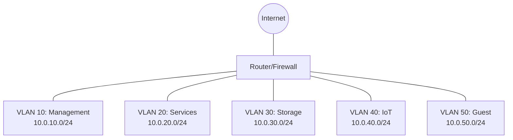

# Network Overview
{: .no_toc }

This section covers the network infrastructure, including topology, VLANs, DNS, and routing configurations.

## Table of contents
{: .no_toc .text-delta }

1. TOC
{:toc}

---

## Network Architecture

The homelab network is designed with security, performance, and flexibility in mind. The network is segmented into multiple VLANs to isolate different types of traffic and improve security.

### Logical Network Diagram

### IP Addressing Scheme

The homelab uses private IP addresses in the 10.0.0.0/8 range, divided into multiple subnets:

| VLAN ID | Purpose     | Subnet        | DHCP Range         | Static Range       |
|:--------|:------------|:--------------|:-------------------|:-------------------|
| 10      | Management  | 10.0.10.0/24  | 10.0.10.100-150    | 10.0.10.1-99       |
| 20      | Services    | 10.0.20.0/24  | 10.0.20.100-200    | 10.0.20.1-99       |
| 30      | Storage     | 10.0.30.0/24  | N/A (Static Only)  | 10.0.30.1-50       |
| 40      | IoT Devices | 10.0.40.0/24  | 10.0.40.100-250    | 10.0.40.1-99       |
| 50      | Guest       | 10.0.50.0/24  | 10.0.50.100-250    | N/A                |

## Core Network Services

The homelab network provides the following core services:

### DHCP
DHCP services are provided by the Unifi Dream Machine Pro for all VLANs. Static DHCP reservations are used for critical devices.

### DNS
- Primary DNS: Internal DNS server (Pi-hole running on a VM)
- Secondary DNS: Router DNS cache
- Upstream DNS: Cloudflare (1.1.1.1) and Google (8.8.8.8)

### Firewall Rules

{: .important }
All inter-VLAN traffic is denied by default. Specific allowances are made for necessary services.

Key firewall rules include:

1. Allow Management VLAN to access all other VLANs
2. Allow Services VLAN to access Storage VLAN (for backups)
3. Deny IoT and Guest VLANs from accessing internal networks
4. Allow all VLANs to access the internet (with restrictions for Guest)

## Network Performance

Current network performance metrics:

- **Internet Connection**: 50Mbps down / 20Mbps up
- **Internal Network**: 1Gbps between wired devices, Wifi-6 for wireless devices
- **Storage Network**: 10Gbps

## Network Monitoring

Network monitoring is handled by:

- Unifi Controller for basic monitoring and statistics
- Grafana dashboards for detailed performance metrics
- Uptime Robot for external monitoring
- Prometheus for collecting metrics

{: .note }
See the [Monitoring](/docs/services/monitoring) section for more details on the monitoring setup.