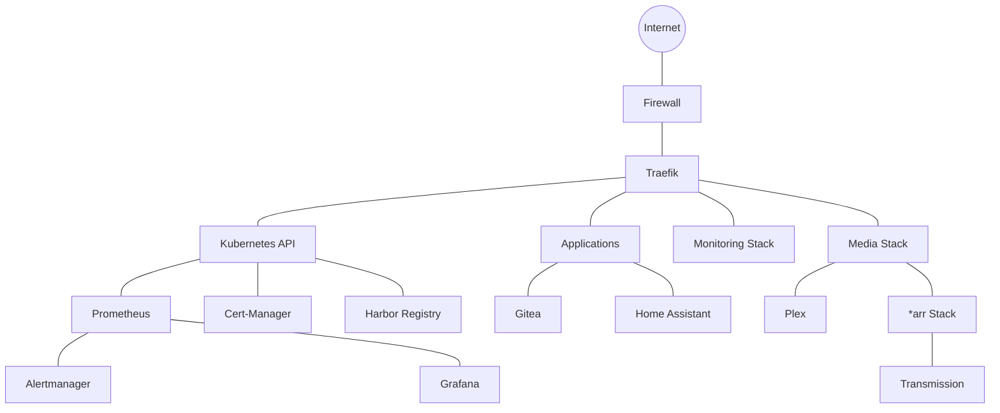

# Services Overview
{: .no_toc }

This section documents the various services running in the homelab environment.

## Table of contents
{: .no_toc .text-delta }

1. TOC
{:toc}

---

## Service Architecture

The homelab services are primarily deployed as containers running on a Kubernetes cluster, with some exceptions for VMs where containerization is not feasible or optimal.

### Service Platform

| Platform | Purpose | Location |
|:---------|:--------|:---------|
| Kubernetes | Container orchestration | Homelab-1 |
| Proxmox VE | Virtualization | Homelab-1 |
| TrueNAS Scale | Storage management | Homelab-2 |

### Service Categories

Services are organized into the following categories:

1. **Infrastructure** - Core services for managing the homelab
2. **Monitoring** - Services for monitoring and alerting
3. **Media** - Media acquisition, management, and streaming
4. **Automation** - Home automation and task automation
5. **Development** - Development tools and environments

## Infrastructure Services

| Service | Purpose | URL | Notes |
|:--------|:--------|:----|:------|
| Kubernetes Dashboard | Kubernetes management UI | [https://k8s.homelab.blue](https://k8s.homelab.blue) | Access via VPN only |
| Traefik | Reverse proxy and ingress controller | [https://traefik.homelab.blue](https://traefik.homelab.blue) | Handles all ingress traffic |
| MetalLB | Bare metal load balancer | N/A | Provides load balancing for services |
| Cert-Manager | Certificate management | N/A | Manages Let's Encrypt certificates |
| Harbor | Docker registry | [https://registry.homelab.blue](https://registry.homelab.blue) | Private container registry |

## Monitoring Services

| Service | Purpose | URL | Notes |
|:--------|:--------|:----|:------|
| Prometheus | Metrics collection | [https://prometheus.homelab.blue](https://prometheus.homelab.blue) | Core monitoring system |
| Grafana | Metrics visualization | [https://grafana.homelab.blue](https://grafana.homelab.blue) | Dashboards for all services |
| Alertmanager | Alert management | [https://alerts.homelab.blue](https://alerts.homelab.blue) | Handles alerting rules |
| Loki | Log aggregation | N/A | Centralized logging |
| Uptime Kuma | Uptime monitoring | [https://uptime.homelab.blue](https://uptime.homelab.blue) | External service monitoring |

## Media Services

| Service | Purpose | URL | Notes |
|:--------|:--------|:----|:------|
| Plex | Media server | [https://plex.homelab.blue](https://plex.homelab.blue) | Media streaming |
| Sonarr | TV show management | [https://sonarr.homelab.blue](https://sonarr.homelab.blue) | TV show automation |
| Radarr | Movie management | [https://radarr.homelab.blue](https://radarr.homelab.blue) | Movie automation |
| Prowlarr | Indexer management | [https://prowlarr.homelab.blue](https://prowlarr.homelab.blue) | Unified indexer |
| Transmission | Download client | [https://transmission.homelab.blue](https://transmission.homelab.blue) | BitTorrent client |

## Service Topology

The diagram below shows the relationships between key services:

## Service Dependencies

Understanding service dependencies is crucial for maintenance:

| Service | Dependencies |
|:--------|:-------------|
| Traefik | None (critical infrastructure) |
| Kubernetes Dashboard | Kubernetes API, Traefik |
| Prometheus | Kubernetes API, Storage |
| Grafana | Prometheus, Loki |
| Plex | Storage, Network |
| \*arr services | Prowlarr, Transmission, Storage |

{: .important }
Always check service dependencies before performing maintenance to avoid unexpected outages.